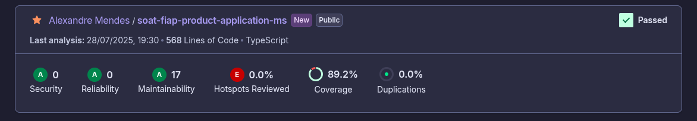

# 🍔 Fastfood - Backend - Product-ms

**Sistema de Autoatendimento para Lanchonete - Backend**

Este é o backend do sistema **Fastfood**, responsável por gerenciar pedidos e operações relacionadas. A API oferece endpoints RESTful para integração com o frontend e outros serviços.

---

## 🛠️ Tecnologias Utilizadas

* **Node.js** (v22.12.0)
* **Express.js** (framework HTTP)
* **DynamoDB** (banco de dados NoSQL gerenciado pela AWS)
* **AWS SDK DocumentClient** (biblioteca para interação com DynamoDB)
* **Swagger/OpenAPI** (documentação interativa da API)
* **Jest** (testes automatizados)
* **TypeScript** (tipagem estática para JavaScript)

---

## 📝 Funcionalidades Principais

* ✅ **Pedidos**: Checkout, atualização de status e listagem agrupada por status.

---

## 🔍 Principais Endpoints

Documentação completa disponível via [Swagger](http://localhost:3000/api-docs)

| Método | Endpoint                        | Função                       |
| ------ | ------------------------------- | ---------------------------- |
| POST   | `/products`                     | Cria novo produto            |
| PUT    | `/products/{id}`                | Atualiza produto existente   |
| DELETE | `/products/{id}`                | Remove produto               |
| GET    | `/products/category/{category}` | Lista produtos por categoria |

---

## 🚀 Instruções de Instalação

### Requisitos

* Node.js v22.12.0+
* Docker + Docker Compose
* Kubernetes (via Minikube)

### Execução Local

```bash
# Clonar o repositório
git clone https://github.com/alexandre-mendes/soat-fiap-application.git
cd soat-fiap-application

# Instalar dependências
npm install
```

### 📂 Configuração do .env

```env
DATABASE_USERNAME="postgres"
DATABASE_PASSWORD="admin"
DATABASE_HOST="localhost"
DATABASE_NAME="postgres"
```

### Rodar a aplicação

```bash
npm run dev
```

### Rodar os testes

```bash
npm run test
```

---

## 🚧 Rodando com Docker

```bash
docker-compose up
```

A aplicação estará disponível em:
[http://localhost:3000](http://localhost:3000)

---

## 🚧 Rodando com Kubernetes (Minikube)

### Build da imagem

```bash
docker build -t software-architecture-fiap-fastfood:latest .
```

### Deploy com kubectl

```bash
kubectl apply -f ./k8s/
```

A aplicação ficará acessível via:
[http://localhost:30300](http://localhost:30300)

---

## 🗂️ Estrutura de Diretórios

```bash
/src
├── /application
│   ├── /usecase          # Casos de uso da aplicação
│   ├── /repository       # Interfaces de repositorios que abstraem a persistencia
│   └── /gateway          # Interfaces de gateway que abstraem chamadas externas
│
├── /domain
│   ├── /entity           # Entidades
│   ├── /vo               # Objetos de valor
│   └── /error            # Erros de negócio
│
├── /infra
│   ├── /api              # Implementação de APIs
│   └── /config           # Configurações como DI e etc
│   └── /database         # Implementação dos repositorios
│   └── /client           # Implementação dos gateways
```
---

## Cobertura


---

## ☁️ Infraestrutura na Nuvem
[Leia mais sobre a infraestrtura na AWS](INFRA.md)
